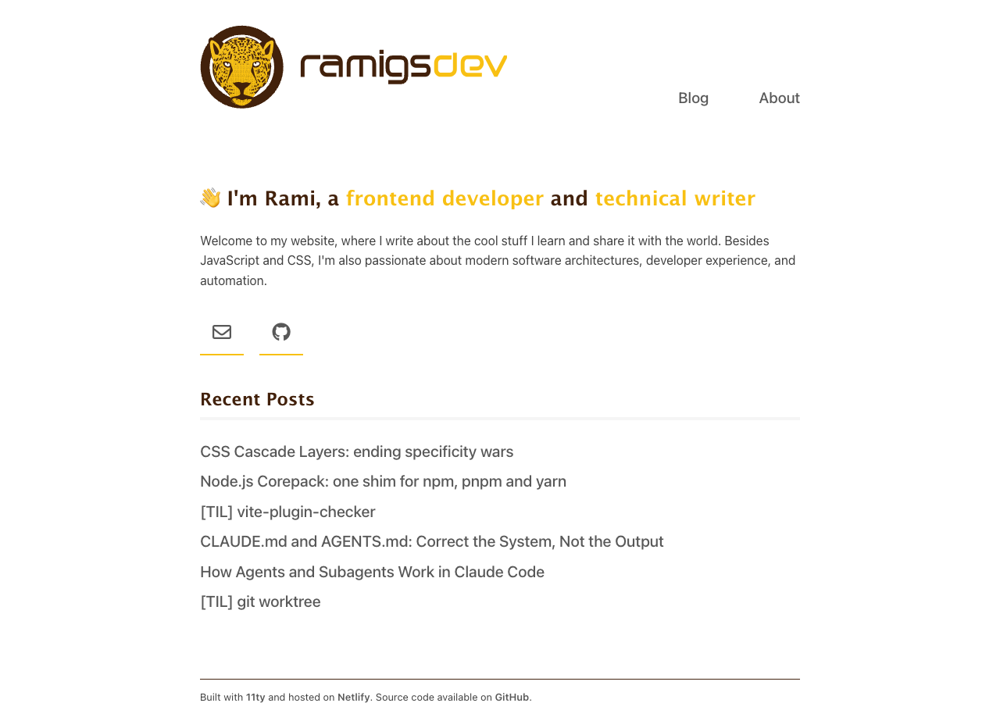
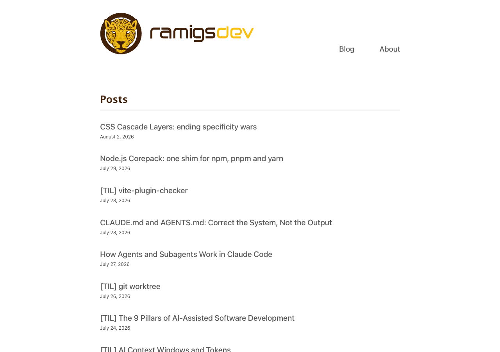

🎉 This happens to be post number 100 — nice timing, landing right as this
site's migration to a new stack wraps up!

## Old stack, new stack

The site launched in 2019 on Eleventy, with Gulp and Webpack handling the build.
It served me well for years, but it hadn't aged well — still pinned to Node
v12, long since end-of-life and twelve(!) major versions behind where the new
stack landed.

A few shots of the old site, for posterity:

The new version moves to Astro, with Vue for the few interactive pieces,
TypeScript throughout, and pnpm managing all of it.

## What was accomplished

All 99 previous posts migrated with the exact same URLs, so nothing that already
pointed here breaks.

The whole design system was rebuilt from scratch — tokens, dark mode, typography
— and the homepage and About page got updated content.

I also went through a proper accessibility pass (keyboard navigation, focus
order, screen reader support via semantic HTML and ARIA) and a performance pass
driven by actual Lighthouse data.

## What's new

A few things worth calling out:

- Dark/light mode, remembers your choice, otherwise follows your system
- An RSS feed
- Reading-time estimates on every post
- Jump-to-year navigation on the blog index
- A TIL/Articles filter on the blog index — built with zero JavaScript, just CSS
  `:has()` selectors
- A skip-to-content link, for keyboard navigation
- A scroll-to-top button
- Properly themed code syntax highlighting for both light and dark mode

## A note on the process

Most of this migration was done with the help of Claude Code, using a single,
persistent `PLAN.md` file as shared context across sessions — a living document
that evolved with the work, tracking decisions and what had actually been
verified. It let each session pick up exactly where the last one left off, and
doubled as a chance to learn Claude Code more in depth, not just to get the
project completed.

## Closing thoughts

The old site served me well for seven years, and there was nothing wrong with it
— Eleventy did exactly what a personal blog needs.

But it was time for a real update. I've learned a lot since then, but hadn't
really had the chance to apply it in my personal site. Plenty has changed in
this space since 2019 too — CSS especially, with things like cascade layers and
`:has()` making entire categories of JavaScript unnecessary.

If anything, this whole project reaffirmed that static sites are still a great
fit for this use case: fast, simple, cheap to host, and — maybe the best part —
the ability to just push to git and have the whole thing rebuild and deploy
automatically is still gold.
