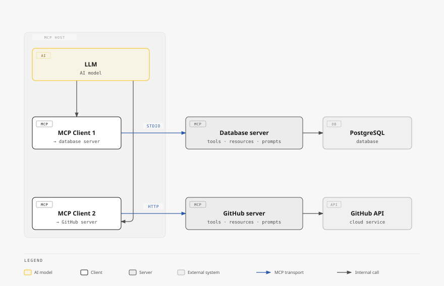

TIL about [`diagram-design`](https://github.com/cathrynlavery/diagram-design), a
Claude Code plugin (also works with Codex, Factory Droid, and Pi) that bundles
an agent skill for generating diagrams — architecture, flowcharts, sequences,
Gantt charts, and dozens of other types — as self-contained HTML and SVG files.

The problem it solves is one I've run into before: ask an AI assistant for a
diagram and you get back a generic rounded-box-and-arrow illustration that looks
nothing like anything else on the page it's meant to sit in. `diagram-design`
fixes that by onboarding your site's actual design tokens — colors, typography,
spacing — in about a minute, then using them for every diagram it generates
afterward. The output is plain HTML with embedded SVG: no build step, no
external dependencies, and it exports cleanly to PNG or SVG when you just need
the image.

The architecture diagram in [today's MCP post](/blog/what-is-mcp/) is a good
showcase of what it can do — same fonts, same color tokens as the rest of this
site, not a generic diagram pasted in from somewhere else:

