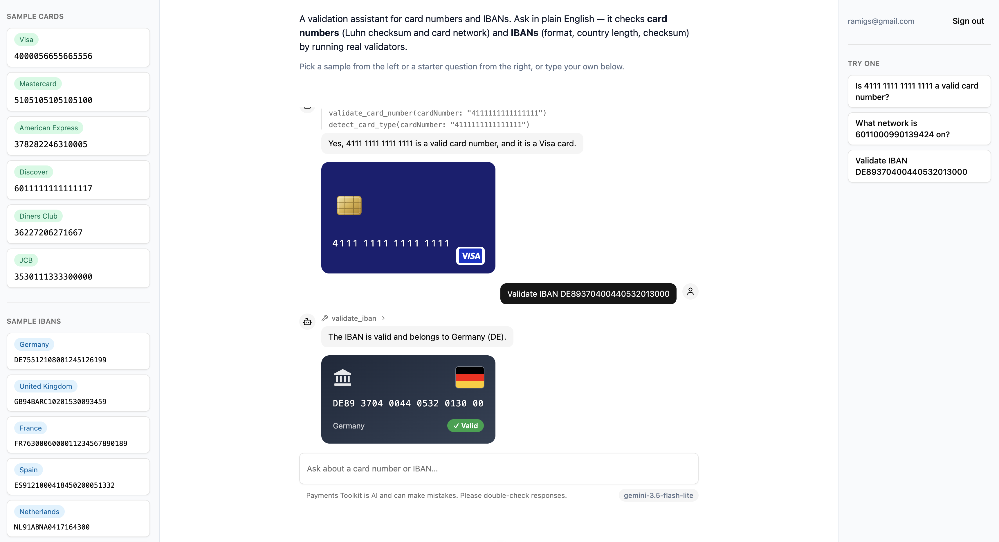
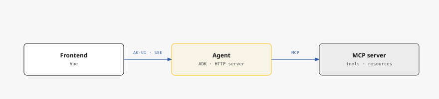

After [writing about MCP](/blog/what-is-mcp/) and [building a small MCP
server](/blog/building-a-small-mcp-server/), the natural next step was wiring
that server up to an actual agent and a UI, end to end. That turned into
three separate repos on GitHub:

- [`payments-toolkit-mcp`](https://github.com/ramigs/payments-toolkit-mcp)
- [`payments-toolkit-agent`](https://github.com/ramigs/payments-toolkit-agent)
- [`payments-toolkit-frontend`](https://github.com/ramigs/payments-toolkit-frontend)

This post is a top-level tour of what each does, the technologies behind
them, and the protocols that tie them together.

## What the app does

It's a validation assistant for **card numbers** and **IBANs**.

You type something like "Is DE89370400440532013000 a valid IBAN?" into a chat
box. An agent decides which validation tool to call, calls it, and streams the
result back.

Besides a plain-text response, the result also renders as a custom widget
coming from the MCP server itself (via MCP Apps): a card widget for card
network, a bank widget for IBAN country.

## Architecture at a glance

Three components, each serving its own purpose:

- **`payments-toolkit-mcp`** owns the validation logic and exposes it as MCP
  tools/resources.
- **`payments-toolkit-agent`** is the backend, the reasoning layer acting as an
  intermediary between the tools and the frontend: an **MCP client** to the
  tools, deciding which one to call, and an **HTTP server** exposing endpoints
  to the frontend, including an **AG-UI** one that streams that decision and its
  result back as a standard event stream.
- **`payments-toolkit-frontend`** is the UI the user actually interacts with and
  an **AG-UI client**. It has no validation logic of its own, it just renders
  whatever the agent streams.

That separation is what lets each side change independently: a different
frontend framework could consume the same AG-UI stream, and a different agent
framework could call the same MCP server.

## payments-toolkit-mcp — the tools

A Node.js app, and the part [already covered in
detail](/blog/building-a-small-mcp-server/): an MCP server exposing three tools
(Luhn checksum validation, card network detection, IBAN validation), a static
resource, and a prompt template. Built on the official
`@modelcontextprotocol/sdk`, TypeScript, Zod for schemas.

It supports both MCP transports:

- **stdio** (default) — a new server process per client, one instance attached
  to that one client.
- **Streamable HTTP** — a single long-running server multiple clients can
  connect to over the network.

Two MCP Apps widgets are also served as UI resources (`ui://...`, each a small
Vite-bundled HTML file): `card-preview` and `iban-preview`. More on that below.

## payments-toolkit-agent — the backend

This is "the brain": where the LLM is selected, the system prompt is written,
and the agent is instantiated.

Also a Node.js app, it uses [Google ADK](https://google.github.io/adk-docs/) as
the agent orchestration framework: it runs the reasoning loop that decides which
tool(s) to call based on the model's output, calls them, and produces the final
response.

The app also includes an HTTP server (Hono) exposing several routes, the most
relevant of which is `POST /chat`, which speaks [AG-UI](https://docs.ag-ui.com)
over Server-Sent Events.

Every route is gated by Supabase bearer-token verification (JWKS) — the token
the frontend attaches once the user logs in.

Because an agent's behavior (which tool it picks, how faithfully it relays a
result) isn't deterministic, that behavior is checked with a **scenario-based
eval suite**, grading tool selection, argument construction, and response
accuracy as three separate axes per scenario.

## payments-toolkit-frontend — the UI

A Vue.js SPA built on [TanStack AI](https://tanstack.com/ai)'s Vue client, which
consumes the agent's AG-UI stream and assembles it into typed message parts as
events arrive, making the live tool-call trace possible.

Login is implemented using Supabase's JS client `@supabase/supabase-js` with
email/password sign-in, producing the session token the backend verifies via
JWKS.

The "sample cards"/"sample IBANs" rails visible in the screenshot above are
one-tap quick-fill values pulled from the backend's `/sample-cards` and
`/sample-ibans` endpoints. And while a turn is streaming, the send button
becomes a Stop button that both aborts the SSE fetch and calls the backend's
`/chat/:runId/cancel` endpoint, so the model request actually dies even if a
proxy is holding the connection open.

## The protocols that tie everything together

- **MCP** allows the agent to connect to where the deterministic validation
  logic actually lives: the agent decides which tool to call, and the MCP server
  computes and returns the result.
- **AG-UI** connects the agent to the frontend. It's a standardized event stream
  over SSE (`RUN_STARTED`, `TOOL_CALL_START/ARGS/END`, `TOOL_CALL_RESULT`,
  `TEXT_MESSAGE_*`, `RUN_FINISHED`). The payoff is that neither side needs to
  know what framework the other is built on. This agent happens to
  hand-translate ADK's internal events into AG-UI's, since no TypeScript bridge
  between the two exists yet (AG-UI already maintains one for the Python ADK, so
  a TypeScript equivalent should become available eventually).
- **MCP Apps** lets a tool ship its own UI alongside its result. A tool
  advertises a `ui://` widget resource, the agent forwards it to the frontend as
  a `CUSTOM` AG-UI event, and the frontend hosts it in a sandboxed, CSP-locked
  iframe. It's what turns a `detect_card_type` result from a JSON blob into an
  actual card UI element.

## Lessons learned

Validating card numbers and IBANs isn't a real-world product. The goal here was
never to ship something people would use. It was to actually understand,
hands-on, how an MCP server, an agent, and a frontend fit together end to end.

I now have a clear picture of how it all ties together, and a much better sense of
the potential of AG-UI and MCP Apps specifically, as real building blocks for
how frontends are evolving in this agentic era.
